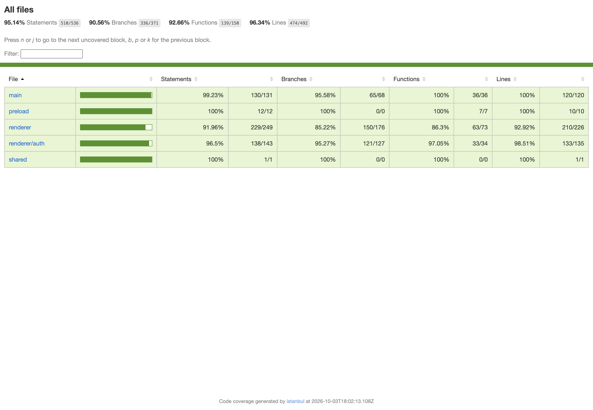

# Week 8 macOS Review Evidence

October 3, 2026. This branch adds Jest and React Testing Library tests, real Electron IPC/window checks, and code coverage. It fixes Settings Cancel, form error links and focus, live search status, and layout at 400% zoom. The base is main commit `bb353f5939d00a0f18c9a165d6d1be87544585a3`.

This is ready for code review. It is not a claim that all 33 plan cases are complete. VoiceOver, actual macOS contrast, the full native shortcut check, and instructor approval remain open. All 33 cases in Tiffany's desktop plan are in scope; instructor approval is **Not verified** for every case.

## Recorded checks

Environment: macOS 26.6.2, Node 22.14.0, npm 10.9.2, Electron 43.7.7. Tests use fresh temporary profiles and restore the clipboard. The logs replace local machine paths with placeholders and trim blank space at line ends; test outcomes are unchanged.

| Check | Result | Evidence |
| --- | --- | --- |
| Jest and React Testing Library | 29 tests pass in 6 suites | [Coverage command log](coverage-command.log) |
| Full automated set | Pass; exit 0 | [Full log](automated-tests.log) |
| Existing Node window-state tests | 5 pass | Full log |
| Electron smoke checks | 15 pass | [Results](smoke-results.json) |
| Electron auth checks | 18 pass | [Results](auth-results.json) |
| Clipboard IPC | Copy, second selection, failure/retry, and bad-payload checks pass | Full log |
| New real-window/IPC suite | 17 named checks pass | [Latest log](integration-tests.log), [results](integration-results.json) |
| ESLint | Pass; exit 0 | [Lint log](lint.log) |

## Coverage

| Measure | Result | Required floor |
| --- | --- | --- |
| Statements | 95.14% | 60% |
| Branches | 90.56% | 60% |
| Functions | 92.66% | 60% |
| Lines | 96.34% | 60% |

Every source file passes the floor in all four measures. Every JS, JSX, and CJS source file under `desktop-electron-app/src/` is included. CSS, dependencies, built bundles, and test code are outside this code metric. No source files are excluded. Jest mocks Electron APIs for main/preload tests and supplies DOM dialog/layout shims. The separate Electron runs test real processes and windows. Code coverage does not prove VoiceOver speech or all plan cases.



[Coverage data](coverage-summary.json) · [Source hashes](source-sha256.json) · [33-case map](TEST_PLAN_MAPPING.md) · [CSV](TEST_PLAN_MAPPING.csv) · [Manual checklist](MANUAL_MACOS_CHECKS.md)

## Run from a fresh checkout

```sh
cd desktop-electron-app
npm ci
npm test -- --coverage
env -u ELECTRON_RUN_AS_NODE npm run test:all
npm run lint
```

Use macOS for the full Electron set. Coverage generates `desktop-electron-app/coverage/lcov-report/index.html`; generated coverage and dependencies stay out of Git. To make a new screenshot after running coverage:

```sh
node scripts/capture-coverage.cjs /absolute/path/coverage-60-plus.png
```

## Review limits

Real-window tests prove saved bounds and maximized state on this Mac. Off-screen bounds use synthetic displays in unit tests; a physical monitor removal has not been tested. The real unsaved-close tests stub the dialog choice while checking actual close events and preserved/discarded data. Native menu callbacks test main-to-renderer IPC; they do not prove every physical key combination. Spoofed IPC sender/frame events are passed directly to the main handler. Contrast and reduced motion use media emulation, not changes to macOS settings.

The prototype's password recovery displays a neutral local demo response. It does not send email or reset a stored password. No real account service was added. No installer, accessibility video, or course submission is included in this change.
